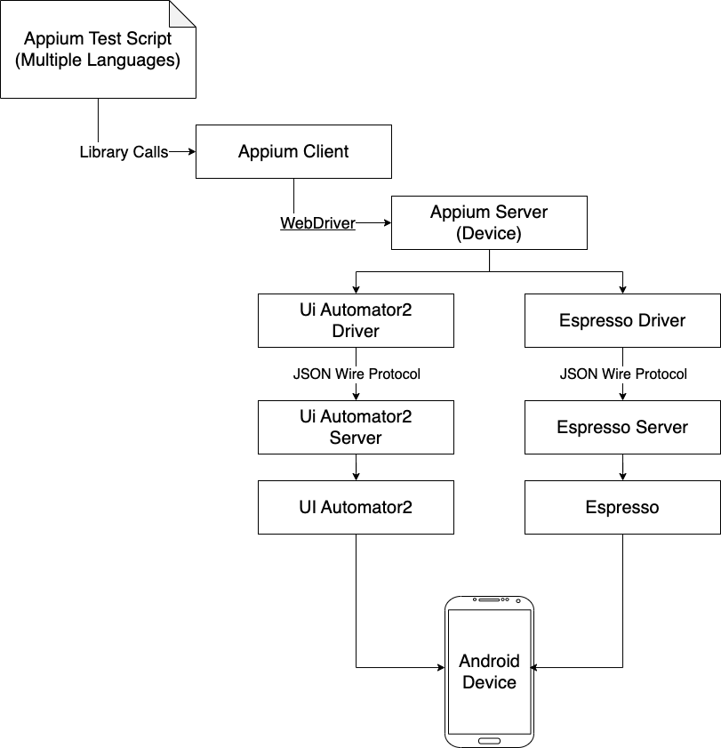

# Test-Translation

# Appium

## Overview

* Appium is implemented based on [WebDriver](https://www.selenium.dev/documentation/webdriver/) protocol.



## Drivers

1. The drivers mapping the WebDriver protocol to the underlying APIs.

2. **All languages will be translated into the same REST API calls.**

#### Locator - XPATH

```python
el = self.driver.find_element(by=AppiumBy.XPATH, value='//*[@text="Battery"]')
```

```sh
# find element
[AndroidUiautomator2Driver@3ba6 (53499867)] Calling AppiumDriver.findElement() with args: ["xpath","//*[@text=\"Battery\"]","53499867-b83b-4a55-8e39-df11c4ae8a75"]

......

[AndroidUiautomator2Driver@3ba6 (53499867)] Proxying [POST /element] to [POST http://127.0.0.1:8200/session/3e9b85a5-991d-4c6e-a3a8-9f67ac16a3e8/element] with body: {"strategy":"xpath","selector":"//*[@text=\"Battery\"]","context":"","multiple":false}
```

### Appium UiAutomator2 Driver

#### Capabilities

* **appium:automationName:** uiautomator2

#### Locator - UiSelector

```python
el = self.driver.find_element(by=AppiumBy.ANDROID_UIAUTOMATOR, value="text(\"Battery\")")
```

```sh
# find element
[AndroidUiautomator2Driver@84b1 (f947d479)] Calling AppiumDriver.findElement() with args: ["-android uiautomator","text(\"Battery\")","f947d479-e27b-4e7f-8802-fdd10cb2f006"]

......

[AndroidUiautomator2Driver@84b1 (f947d479)] Proxying [POST /element] to [POST http://127.0.0.1:8201/session/33a13a14-eaaf-48cd-8ccf-3b35f7ede44a/element] with body: {"strategy":"-android uiautomator","selector":"text(\"Battery\")","context":"","multiple":false}
```

```sh
# click
[AndroidUiautomator2Driver@e4ff (ab5f39dc)] Calling AppiumDriver.click() with args: ["00000000-0000-0082-0000-000300000004","ab5f39dc-6efb-431f-a0fa-e33a1586a253"]
[AndroidUiautomator2Driver@e4ff (ab5f39dc)] Matched '/element/00000000-0000-0082-0000-000300000004/click' to command name 'click'
[AndroidUiautomator2Driver@e4ff (ab5f39dc)] Proxying [POST /element/00000000-0000-0082-0000-000300000004/click] to [POST http://127.0.0.1:8200/session/1e78cd56-cea9-4b22-afb2-aee4987fd94d/element/00000000-0000-0082-0000-000300000004/click] with body: {"element":"00000000-0000-0082-0000-000300000004"}
[AndroidUiautomator2Driver@e4ff (ab5f39dc)] Got response with status 200: {"sessionId":"1e78cd56-cea9-4b22-afb2-aee4987fd94d","value":null}
[AndroidUiautomator2Driver@e4ff (ab5f39dc)] Responding to client with driver.click() result: null
[HTTP] <-- POST /session/ab5f39dc-6efb-431f-a0fa-e33a1586a253/element/00000000-0000-0082-0000-000300000004/click 200 655 ms - 14
```

### Appium Espresso Drivers

* The driver (written in Node.js) ensures the communication between the Espresso server and Appium.
* The server part (written in Kotlin and Java) is running on the device under test and **transforms REST API calls into low-level Espresso commands**.

## Idea

* No matter what kind of locator each action is using, we should always translate it by a strategy that can maximise the quality of test code (e.g. fewer test LOCs, lesser execution time).

## Server

### appium-uiautomator2-server

* Handling and responding to requests by redirecting request to corresponding **handler**.
* **Handlers** will request UI Automator v2 to perform corresponding **acion** and status of handler will be capture in **AppiumResponse**.
* Captured **AppiumResponse** will be returned to appium.

#### Logcat

```sh
# find element
2023-11-13 14:19:42.612  3733-3768  appium                  io.appium.uiautomator2.server        I  AppiumResponse: {"sessionId":"68681fbe-918f-4fda-acd6-ac9586c96c29","value":{"androidId":"27282751669a751d","apiVersion":"34","bluetooth":{"state":"ON"},"brand":"google","carrierName":"T-Mobile","displayDensity":440,"locale":"en_US","manufacturer":"Google","model":"sdk_gphone64_x86_64","networks":[{"capabilities":{…
2023-11-13 14:19:43.126   644-1952  AppsFilter              system_server                        I  interaction: PackageSetting{c480d2f io.appium.uiautomator2.server.test/10183} -> PackageSetting{80d26a6 com.example.toyaut/10203} BLOCKED
2023-11-13 14:19:45.217  3733-3768  appium                  io.appium.uiautomator2.server        I  channel read: POST /session/68681fbe-918f-4fda-acd6-ac9586c96c29/element
2023-11-13 14:19:45.218  3733-3768  appium                  io.appium.uiautomator2.server        I  FindElement command
2023-11-13 14:19:45.221  3733-3768  appium                  io.appium.uiautomator2.server        I  method: 'xpath', selector: '//*[@text="Hello Android!"]'

......

# click
2023-11-13 14:19:46.582  3733-3768  appium                  io.appium.uiautomator2.server        I  AppiumResponse: {"sessionId":"68681fbe-918f-4fda-acd6-ac9586c96c29","value":{"ELEMENT":"00000000-0000-0100-0000-000300000004","element-6066-11e4-a52e-4f735466cecf":"00000000-0000-0100-0000-000300000004"}}
2023-11-13 14:19:46.594  3733-3768  appium                  io.appium.uiautomator2.server        I  channel read: POST /session/68681fbe-918f-4fda-acd6-ac9586c96c29/element/00000000-0000-0100-0000-000300000004/click
2023-11-13 14:19:46.595  3733-3768  appium                  io.appium.uiautomator2.server        I  Click command
```

#### Handlers

```java
// io.appium.uiautomator2.utils.Device

// ...
import androidx.test.uiautomator.UiDevice;
// ...
public static UiDevice getUiDevice() {
    return UiDevice.getInstance(getInstrumentation());
}
// ...
```

```java
// io.appium.uiautomator2.handler.Tap

// ...
import static io.appium.uiautomator2.utils.Device.getUiDevice;
// ...
if (!getUiDevice().click(tapLocation.x.intValue(), tapLocation.y.intValue())) {
    throw new InvalidElementStateException(String.format("Tap at %s has failed", tapLocation));
}
// ...
```


### Idea

* The Appium REST API calls are not directly **translated** to UI Automator test code. The UI Automator actions are **called** by the Appium UI Automator2 server.


# ChatGPT Translation

## Case 1

Appium Python Test Code (XPATH locator) to Espresso Kotlin Test Code

* Prompt

  *translate this Appium call to UI Automator test code in Kotlin* 

* Original Appium Python Test Code

```python
el = self.driver.find_element(by=AppiumBy.XPATH, value='//*[@text="Hello Android!"]')
```

* Translated Espresso Kotlin Test Code

```kotlin
onView(withText("Hello Android!")).perform(click())
```

* Results

  The test case can pass, but the generated code is not equivalent. The original code does not contain **click** action.

## Case 2

AppiumDriver API call to UI Automator Kotlin Test code

* Prompt

  *Translate this Appium test code to UI Automator or Espresso in Kotlin. If the test code does not involve cross-application interactions, translate it to Espresso, otherwise, translate it to UI Automator.*

* Original AppiumDriver API Call

  ```shell
  [AndroidUiautomator2Driver@5be1 (63a9e4f8)] Calling AppiumDriver.findElement() with args: ["xpath","//*[@text=\"Hello Android!\"]","63a9e4f8-125d-4822-8532-2a3136b4fb83"]
  ```

* Translated UI Automator Test Code

  ```kotlin
  val uiDevice = UiDevice.getInstance(InstrumentationRegistry.getInstrumentation())
  
  // Using UiSelector to find an element by text containing "Hello Android!"
  val element = uiDevice.findObject(UiSelector().textContains("Hello Android!"))
  
  // Perform actions on the found element
  element.click()
  ```

* Results

  ChatGPT generates code in both UI Automator and Espresso.

  The test can pass, but the generated code is not equivalent. The original locator is **text** while the translated one is **textContains**.

## Case 3

AppiumDriver API call to UI Automator Kotlin Test code using **By** selector

* Prompt

​	*translate this Appium call to UI Automator test code in Kotlin using By selector*

* Original AppiumDriver API Call

  ```shell
  [AndroidUiautomator2Driver@5be1 (63a9e4f8)] Calling AppiumDriver.findElement() with args: ["xpath","//*[@text=\"Hello Android!\"]","63a9e4f8-125d-4822-8532-2a3136b4fb83"] 
  ```

* Translated UI Automator Test Code

  ```kotlin
  val uiDevice = UiDevice.getInstance(InstrumentationRegistry.getInstrumentation())
  
  // Using By.text to find an element by text
  val element = uiDevice.findObject(By.text("Hello Android!"))
  
  // Perform actions on the found element
  element.click()
  ```

* Results

  The test can pass and it is code is equivalent.